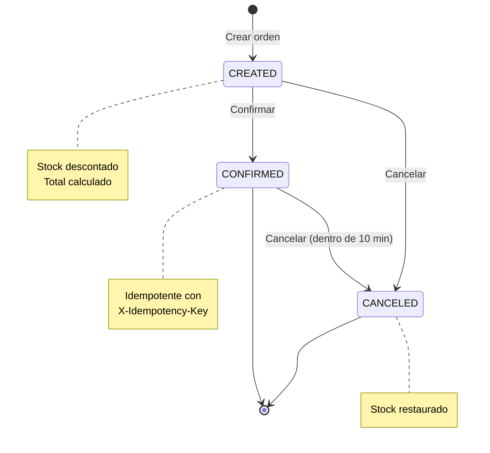

<div align="center"> 

# 📦️ B2B Order Management System

Sistema de gestión de pedidos B2B compuesto por dos APIs REST (Customers y Orders) y un Lambda orquestador, construido con Node.js, TypeScript, MySQL y Serverless Framework.

</div>

## Tabla de Contenido

- [Descripción General](#descripción-general)
- [Arquitectura del Sistema](#arquitectura-del-sistema)
- [Tecnologías Utilizadas](#tecnologías-utilizadas)
- [Requisitos Previos](#requisitos-previos)
- [Instalación](#instalación)
- [Configuración](#configuración)
- [Estructura del Proyecto](#estructura-del-proyecto)
- [APIs Disponibles](#apis-disponibles)
    - [Customers API](#customers-api)
    - [Orders API](#orders-api)
    - [Lambda Orchestrator](#lambda-orchestrator)
- [Flujos de Negocio](#flujos-de-negocio)
- [Uso y Ejemplos](#uso-y-ejemplos)
- [Base de Datos](#base-de-datos)
- [Testing](#testing)
- [Deployment](#deployment)
- [Troubleshooting](#troubleshooting)

## Descripción General

Este sistema implementa un backoffice de pedidos B2B que permite:

- Gestionar clientes y sus datos de contacto
- Administrar catálogo de productos con control de inventario
- Crear órdenes de compra con validación automática de stock
- Confirmar pedidos de manera idempotente
- Cancelar órdenes con restauración automática de inventario
- Orquestar flujos complejos mediante AWS Lambda

## Arquitectura del Sistema

### Diagrama de Componentes


### Diagrama de Secuencia - Flujo de Orquestación


### Diagrama de Estados - Orden



## Tecnologías Utilizadas

- **Runtime**: Node.js 20.x
- **Lenguaje**: TypeScript 5.x
- **Framework Web**: Express 4.x
- **Base de Datos**: MySQL 8.0
- **Validación**: Zod 3.x
- **Serverless**: Serverless Framework 3.x
- **Bundler**: esbuild
- **Package Manager**: pnpm
- **Containerización**: Docker & Docker Compose
- **HTTP Client**: Axios
- **Autenticación**: JWT & Service Tokens

## Requisitos Previos

- **Node.js**: >= 18.0.0
- **pnpm**: >= 8.0.0
- **Docker**: >= 20.0.0
- **Docker Compose**: >= 2.0.0
- **(Opcional) AWS CLI**: Para deployment a AWS

### Instalación de Dependencias Globales

```bash
# Instalar pnpm si no lo tienes
npm install -g pnpm

# Verificar versiones
node --version
pnpm --version
docker --version
docker-compose --version
```

## Instalación

### 1. Clonar el Repositorio

```bash
git clone <repository-url>
cd customers-orders
```

### 2. Instalar Dependencias

```bash
# Instalar todas las dependencias del monorepo
pnpm install
```

### 3. Configurar Variables de Entorno

```bash
# Copiar archivos de ejemplo
cp customers-api/.env.example customers-api/.env
cp orders-api/.env.example orders-api/.env
cp lambda-orchestrator/.env.example lambda-orchestrator/.env
```

### 4. Levantar Servicios con Docker

```bash
# Iniciar MySQL
docker-compose up -d mysql

# Esperar a que MySQL esté listo (30 segundos aproximadamente)
docker-compose logs -f mysql
# Buscar el mensaje: "ready for connections"

# Verificar que las tablas y datos se crearon
docker-compose exec mysql mysql -uroot -prootpassword customers_orders -e "SHOW TABLES;"
```

### 5. Iniciar las APIs

```bash
# Terminal 1 - Customers API
cd customers-api
pnpm dev

# Terminal 2 - Orders API
cd orders-api
pnpm dev

# Terminal 3 - Lambda Orchestrator
cd lambda-orchestrator
pnpm dev
```

### 6. Verificar Health Checks

```bash
# Customers API
curl http://localhost:3001/health

# Orders API
curl http://localhost:3002/health

# Lambda debe estar disponible en
# http://localhost:3000/orchestrator/create-and-confirm-order
```

## Configuración

### Variables de Entorno

#### Customers API (.env)

```env
NODE_ENV=development
PORT=3001

DB_HOST=localhost
DB_PORT=3306
DB_USER=app_user
DB_PASSWORD=app_password
DB_NAME=customers_orders

JWT_SECRET=your-jwt-secret-key-change-in-production
JWT_EXPIRES_IN=24h

SERVICE_TOKEN=your-service-token-change-in-production

LOG_LEVEL=info
```

#### Orders API (.env)

```env
NODE_ENV=development
PORT=3002

DB_HOST=localhost
DB_PORT=3306
DB_USER=app_user
DB_PASSWORD=app_password
DB_NAME=customers_orders

JWT_SECRET=your-jwt-secret-key-change-in-production
JWT_EXPIRES_IN=24h

SERVICE_TOKEN=your-service-token-change-in-production

CUSTOMERS_API_BASE=http://localhost:3001

IDEMPOTENCY_KEY_EXPIRATION_HOURS=24
ORDER_CANCELLATION_WINDOW_MINUTES=10

LOG_LEVEL=info
```

#### Lambda Orchestrator (.env)

```env
CUSTOMERS_API_BASE=http://localhost:3001
ORDERS_API_BASE=http://localhost:3002
SERVICE_TOKEN=your-service-token-change-in-production

AWS_REGION=us-east-1
SERVERLESS_OFFLINE_PORT=3000

LOG_LEVEL=info
```

## Estructura del Proyecto

```
customers-orders/
├── customers-api/
│   ├── src/
│   │   ├── config/
│   │   │   ├── env.ts
│   │   │   └── database.ts
│   │   ├── middleware/
│   │   │   ├── auth.ts
│   │   │   ├── validate.ts
│   │   │   └── errorHandler.ts
│   │   ├── models/
│   │   │   └── customer.ts
│   │   ├── controllers/
│   │   │   └── customerController.ts
│   │   ├── routes/
│   │   │   ├── customerRoutes.ts
│   │   │   └── internalRoutes.ts
│   │   ├── types/
│   │   │   └── index.ts
│   │   ├── utils/
│   │   │   └── schemas.ts
│   │   ├── app.ts
│   │   └── index.ts
│   ├── Dockerfile
│   ├── openapi.yaml
│   ├── tsconfig.json
│   └── package.json
│
├── orders-api/
│   ├── src/
│   │   ├── config/
│   │   ├── middleware/
│   │   │   ├── auth.ts
│   │   │   ├── validate.ts
│   │   │   ├── idempotency.ts
│   │   │   └── errorHandler.ts
│   │   ├── models/
│   │   │   ├── product.ts
│   │   │   └── order.ts
│   │   ├── controllers/
│   │   │   ├── productController.ts
│   │   │   └── orderController.ts
│   │   ├── routes/
│   │   │   ├── productRoutes.ts
│   │   │   └── orderRoutes.ts
│   │   ├── services/
│   │   │   ├── customersApiClient.ts
│   │   │   └── idempotencyService.ts
│   │   ├── types/
│   │   ├── utils/
│   │   ├── app.ts
│   │   └── index.ts
│   ├── Dockerfile
│   ├── openapi.yaml
│   ├── tsconfig.json
│   └── package.json
│
├── lambda-orchestrator/
│   ├── src/
│   │   ├── services/
│   │   │   ├── customersApiClient.ts
│   │   │   ├── ordersApiClient.ts
│   │   │   └── orchestratorService.ts
│   │   ├── types/
│   │   │   └── index.ts
│   │   └── handler.ts
│   ├── serverless.yml
│   ├── tsconfig.json
│   └── package.json
│
├── db/
│   ├── schema.sql
│   └── seed.sql
│
├── docker-compose.yml
├── pnpm-workspace.yaml
├── package.json
└── README.md
```

## APIs Disponibles

### Customers API

**Base URL**: `http://localhost:3001`

#### Endpoints Públicos

| Método | Endpoint         | Descripción                    | Autenticación |
| ------ | ---------------- | ------------------------------ | ------------- |
| GET    | `/health`        | Health check                   | No            |
| POST   | `/customers`     | Crear cliente                  | No            |
| GET    | `/customers`     | Listar clientes                | No            |
| GET    | `/customers/:id` | Obtener cliente                | No            |
| PUT    | `/customers/:id` | Actualizar cliente             | No            |
| DELETE | `/customers/:id` | Eliminar cliente (soft delete) | No            |

#### Endpoints Internos

| Método | Endpoint                  | Descripción     | Autenticación |
| ------ | ------------------------- | --------------- | ------------- |
| GET    | `/internal/customers/:id` | Validar cliente | SERVICE_TOKEN |

**Documentación OpenAPI**: [customers-api/openapi.yaml](./customers-api/openapi.yaml)

### Orders API

**Base URL**: `http://localhost:3002`

#### Productos

| Método | Endpoint        | Descripción             |
| ------ | --------------- | ----------------------- |
| POST   | `/products`     | Crear producto          |
| GET    | `/products`     | Listar productos        |
| GET    | `/products/:id` | Obtener producto        |
| PATCH  | `/products/:id` | Actualizar precio/stock |

#### Órdenes

| Método | Endpoint              | Descripción             | Headers Especiales  |
| ------ | --------------------- | ----------------------- | ------------------- |
| POST   | `/orders`             | Crear orden             | -                   |
| GET    | `/orders`             | Listar órdenes          | -                   |
| GET    | `/orders/:id`         | Obtener orden con items | -                   |
| POST   | `/orders/:id/confirm` | Confirmar orden         | `X-Idempotency-Key` |
| POST   | `/orders/:id/cancel`  | Cancelar orden          | -                   |

**Documentación OpenAPI**: [orders-api/openapi.yaml](./orders-api/openapi.yaml)

### Lambda Orchestrator

**Base URL**: `http://localhost:3000`

#### Endpoint

| Método | Endpoint                                 | Descripción                                |
| ------ | ---------------------------------------- | ------------------------------------------ |
| POST   | `/orchestrator/create-and-confirm-order` | Orquesta creación y confirmación de pedido |

**Request Body**:

```json
{
    "customer_id": 1,
    "items": [
        {
            "product_id": 2,
            "qty": 3
        }
    ],
    "idempotency_key": "unique-key-123",
    "correlation_id": "optional-correlation-id"
}
```

**Response**:

```json
{
    "success": true,
    "correlationId": "optional-correlation-id",
    "data": {
        "customer": {
            "id": 1,
            "name": "ACME Corporation",
            "email": "ops@acme.com",
            "phone": "+1-555-0100"
        },
        "order": {
            "id": 5,
            "status": "CONFIRMED",
            "total_cents": 389700,
            "items": [
                {
                    "product_id": 2,
                    "qty": 3,
                    "unit_price_cents": 129900,
                    "subtotal_cents": 389700
                }
            ]
        }
    }
}
```

## Flujos de Negocio

### Crear y Confirmar Pedido (Orquestación)


### Cancelar Orden con Validación de Tiempo


## Uso y Ejemplos

### Ejemplos con cURL

#### 1. Crear un Cliente

```bash
curl -X POST http://localhost:3001/customers \
  -H "Content-Type: application/json" \
  -d '{
    "name": "Tech Solutions Inc",
    "email": "contact@techsolutions.com",
    "phone": "+1-555-0200"
  }'
```

#### 2. Crear un Producto

```bash
curl -X POST http://localhost:3002/products \
  -H "Content-Type: application/json" \
  -d '{
    "sku": "LAPTOP-DELL-2024",
    "name": "Dell Latitude 7430",
    "price_cents": 159900,
    "stock": 15
  }'
```

#### 3. Crear una Orden

```bash
curl -X POST http://localhost:3002/orders \
  -H "Content-Type: application/json" \
  -d '{
    "customer_id": 1,
    "items": [
      {
        "product_id": 2,
        "qty": 2
      },
      {
        "product_id": 3,
        "qty": 1
      }
    ]
  }'
```

#### 4. Confirmar Orden (Idempotente)

```bash
curl -X POST http://localhost:3002/orders/3/confirm \
  -H "Content-Type: application/json" \
  -H "X-Idempotency-Key: unique-key-abc-123"
```

#### 5. Orquestar Pedido Completo

```bash
curl -X POST http://localhost:3000/orchestrator/create-and-confirm-order \
  -H "Content-Type: application/json" \
  -d '{
    "customer_id": 1,
    "items": [
      {
        "product_id": 2,
        "qty": 3
      }
    ],
    "idempotency_key": "order-2024-001",
    "correlation_id": "req-12345"
  }'
```

#### 6. Cancelar Orden

```bash
curl -X POST http://localhost:3002/orders/3/cancel \
  -H "Content-Type: application/json"
```

#### 7. Listar Órdenes con Filtros

```bash
# Por status
curl "http://localhost:3002/orders?status=CONFIRMED"

# Por rango de fechas
curl "http://localhost:3002/orders?from=2024-01-01&to=2024-12-31"

# Con paginación
curl "http://localhost:3002/orders?limit=10&cursor=5"
```

#### 8. Buscar Clientes

```bash
curl "http://localhost:3001/customers?search=ACME&limit=20"
```

## Base de Datos

### Esquema de Tablas

El esquema completo se encuentra en [db/schema.sql](./db/schema.sql)

#### Tablas Principales

- **customers**: Información de clientes
- **products**: Catálogo de productos
- **orders**: Órdenes de compra
- **order_items**: Items de cada orden
- **idempotency_keys**: Control de idempotencia

### Diagrama ER


### Datos de Ejemplo

El sistema incluye datos de ejemplo en [db/seed.sql](./db/seed.sql):

- 5 clientes de ejemplo
- 10 productos con stock
- 2 órdenes de ejemplo

## Testing

### Ejecutar Tests

```bash
# Tests de todas las APIs
pnpm test

# Tests de un servicio específico
cd customers-api && pnpm test
cd orders-api && pnpm test
```

### Testing Manual

Se incluye una colección de [Postman Collection](./postman/B2B-Order-Management.postman_collection.json) con todos los endpoints en el repositorio.

## Deployment

### Deployment Local con Docker

```bash
# Build de todas las imágenes
docker-compose build

# Levantar todos los servicios
docker-compose up -d

# Ver logs
docker-compose logs -f

# Detener servicios
docker-compose down
```

### Deployment del Lambda a AWS

#### Prerequisitos

```bash
# Configurar credenciales AWS
aws configure

# Instalar Serverless CLI globalmente (si no lo tienes)
npm install -g serverless
```

#### Steps

1. **Actualizar variables de entorno**

Editar `lambda-orchestrator/.env`:

```env
CUSTOMERS_API_BASE=https://api.example.com/customers
ORDERS_API_BASE=https://api.example.com/orders
SERVICE_TOKEN=your-production-token
```

2. **Deploy**

```bash
cd lambda-orchestrator
pnpm deploy
```

3. **Verificar**

```bash
# Ver información del deployment
serverless info

# Ver logs en tiempo real
serverless logs -f orchestrator -t
```

4. **Remover (si es necesario)**

```bash
serverless remove
```

### Deployment de APIs a AWS

Las APIs pueden desplegarse usando:

- AWS Elastic Beanstalk
- AWS ECS/Fargate
- AWS EC2 con Docker
- AWS App Runner

Ejemplo con Docker + ECR:

```bash
# Build y push a ECR
docker build -t customers-api ./customers-api
docker tag customers-api:latest <ecr-url>/customers-api:latest
docker push <ecr-url>/customers-api:latest
```

## Troubleshooting

### MySQL no inicia correctamente

```bash
# Ver logs de MySQL
docker-compose logs mysql

# Reiniciar MySQL
docker-compose restart mysql

# Recrear el contenedor
docker-compose down
docker volume rm customers-orders_mysql_data
docker-compose up -d mysql
```

### Error de conexión a la base de datos

Verificar que MySQL esté listo antes de iniciar las APIs:

```bash
docker-compose exec mysql mysqladmin ping -h localhost -uroot -prootpassword
```

### Puerto en uso

Si algún puerto está ocupado, modificar el puerto en el `.env` correspondiente.

```bash
# Verificar qué está usando un puerto
lsof -i :3001
lsof -i :3002
lsof -i :3000
```

### Lambda no puede conectar a las APIs

Verificar que las URLs en `lambda-orchestrator/.env` sean correctas:

- Local: `http://localhost:PORT`
- Docker: usar nombres de servicio (e.g., `http://customers-api:3001`)

### Error de idempotencia

Las llaves de idempotencia expiran después de 24 horas por defecto. Usar una nueva llave si es necesario.

### TypeScript compilation errors

```bash
# Limpiar y rebuilder
pnpm clean
pnpm build
```

## Scripts Útiles

```bash
# Desarrollo
pnpm dev                    # Iniciar todos los servicios
pnpm customers:dev          # Solo Customers API
pnpm orders:dev             # Solo Orders API
pnpm lambda:dev             # Solo Lambda

# Build
pnpm build                  # Build de todos los servicios

# Docker
docker-compose build         # Build de imágenes
docker-compose up -d         # Levantar contenedores
docker-compose down          # Detener contenedores
docker-compose logs -f       # Ver logs

# Base de datos
pnpm db:setup               # Ejecutar schema + seed

# Limpieza
pnpm clean                  # Limpiar archivos build
```

**Documentación de APIs**:

- [Customers API OpenAPI](./customers-api/openapi.yaml)
- [Orders API OpenAPI](./orders-api/openapi.yaml)
